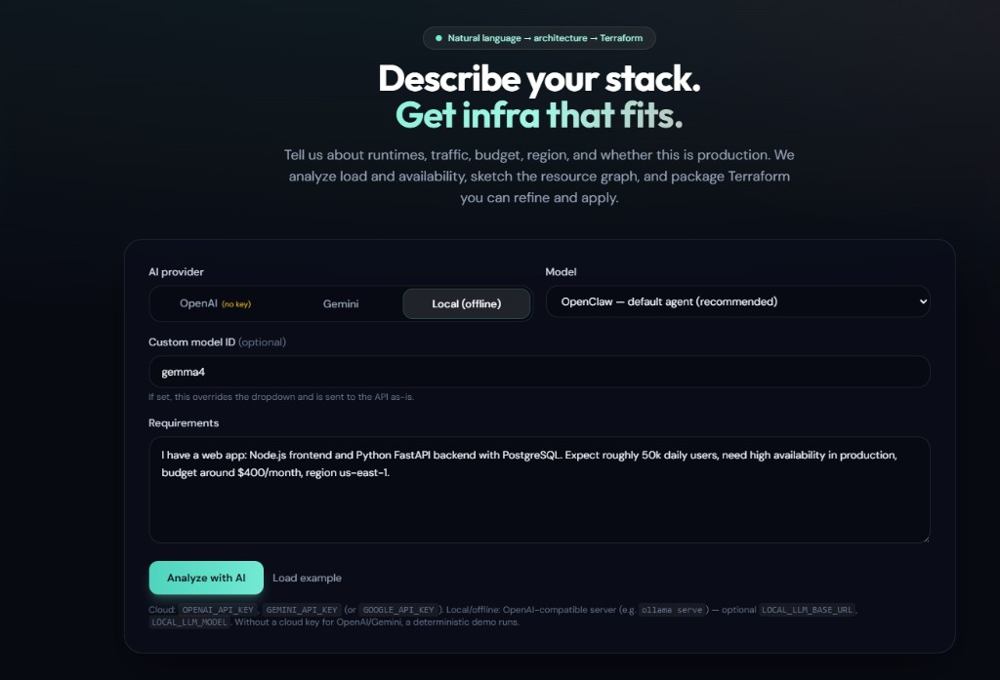
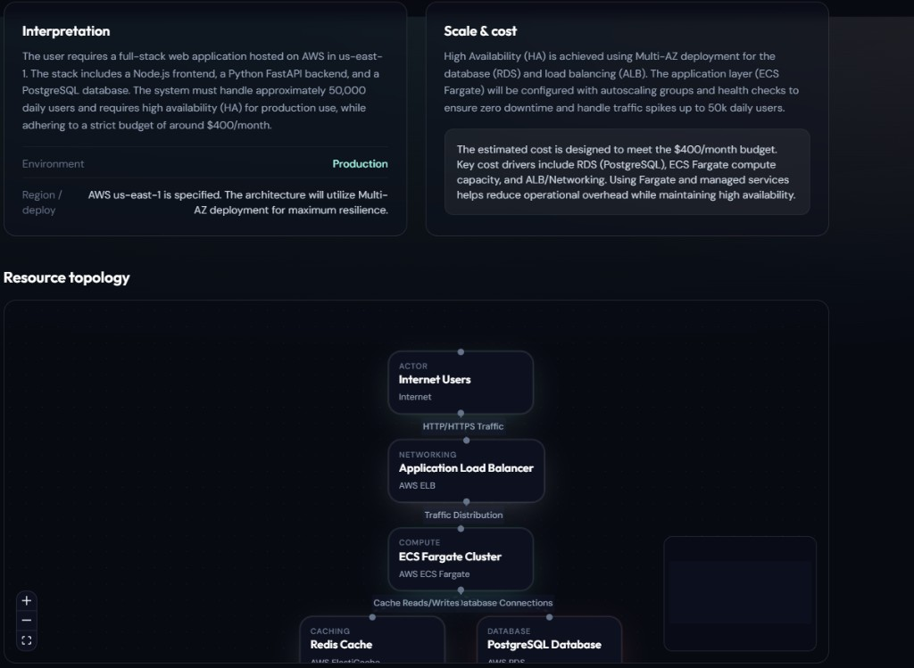
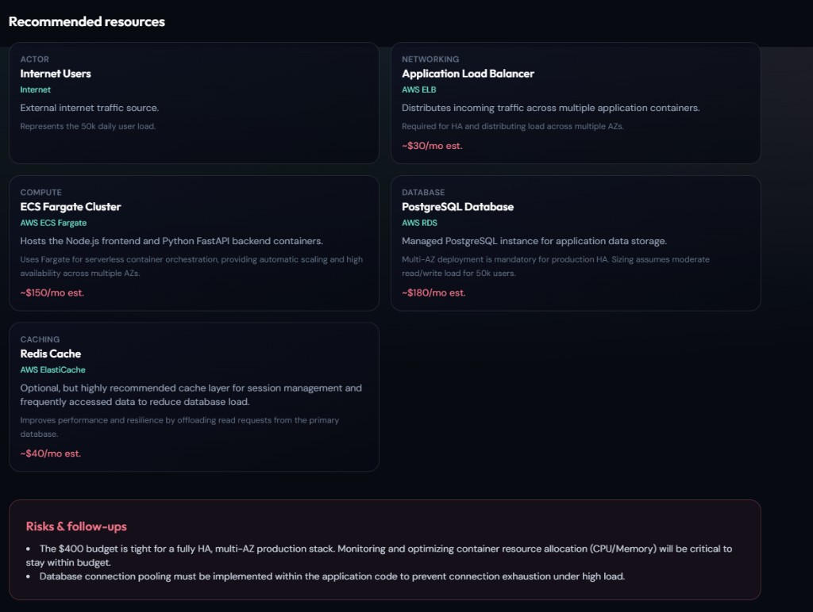
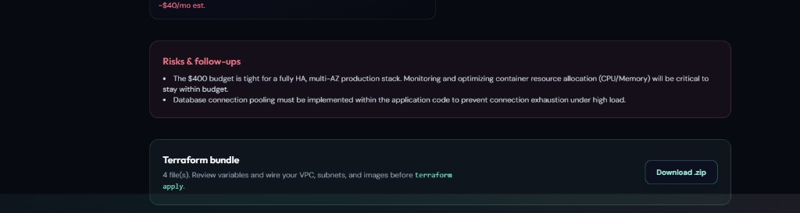
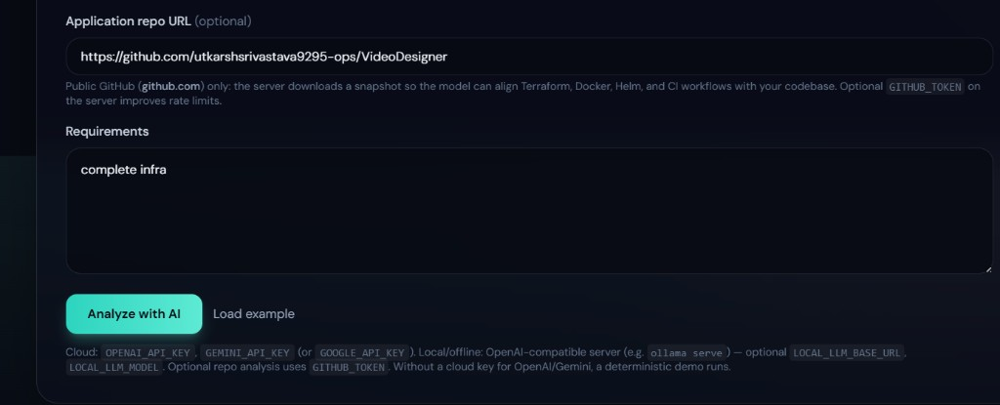
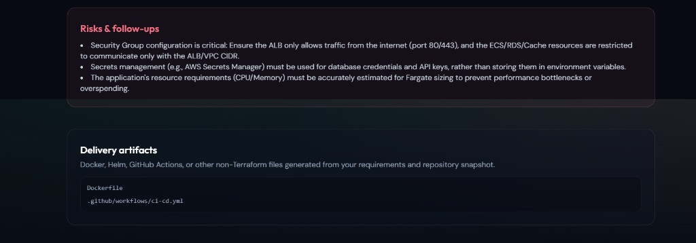
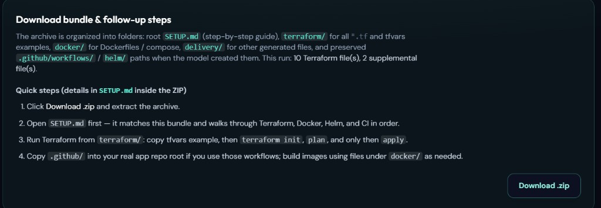
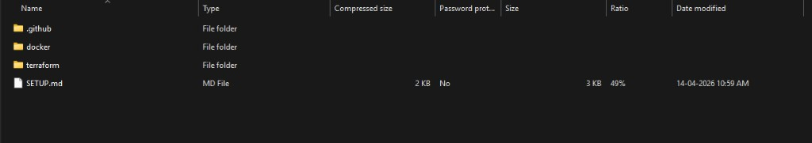

# NLP → Infra

**Natural language → architecture → Terraform**

Describe hosting needs in plain language. The app returns an AI-backed interpretation, an interactive **resource topology** graph, line-item **recommendations with rough costs**, **risks and follow-ups**, and a **Terraform bundle** (ZIP) you can refine before `terraform apply`.

---

## Example walkthrough (sample)

Below is the same flow illustrated in the screenshots under [`docs/images/`](docs/images/).

### 1. Input: provider, model, and requirements

Pick **OpenAI**, **Gemini**, or **Local (offline)**; choose a model (or override with a custom model id). Paste requirements and click **Analyze with AI**.



**Sample prompt** (also available via *Load example* in the UI):

> I have a web app: Node.js frontend and Python FastAPI backend with PostgreSQL. Expect roughly 50k daily users, need high availability in production, budget around $400/month, region us-east-1.

### 2. Interpretation, scale & cost, and topology

The response summarizes **environment** (e.g. production), **region**, **HA and scaling** (multi-AZ, ALB, ECS Fargate autoscaling, health checks), and a **cost narrative** aligned with your budget. The **resource topology** shows how traffic flows (e.g. users → ALB → ECS → Redis / RDS).



### 3. Recommended resources

Each node becomes a card: service type, AWS (or other) product, rationale, and optional **~$/month** estimates.



*Example line items from the sample above:*

| Area        | Focus                         | Example service        | ~Est. / mo |
|------------|--------------------------------|-------------------------|------------|
| Actor      | External traffic (~50k DAU)   | Public internet         | —          |
| Networking | HA, multi-AZ distribution     | Application Load Balancer | ~$30     |
| Compute    | Frontend + API containers     | ECS Fargate             | ~$150      |
| Database   | Managed PostgreSQL, Multi-AZ  | Amazon RDS              | ~$180      |
| Caching    | Sessions / hot reads          | ElastiCache (Redis)     | ~$40       |

Figures are **ballpark**; treat them as planning hints, not invoices.

### 4. Risks & follow-ups and Terraform bundle

**Risks** might call out a tight budget for full HA, the need to tune **CPU/memory** on tasks, or **DB connection pooling** in application code.

The **Terraform bundle** lists how many files were generated. Use **Download .zip**, then fill `terraform.tfvars`, wire **VPC, subnets, ACM, and container images**, and run `terraform init` / `plan` before apply.



Terraform is generated as **multiple `.tf` files** by concern (for example `providers.tf`, `variables.tf`, `alb.tf`, `ecs.tf`, `rds.tf`, `elasticache.tf`, `iam_ecs.tf`, `outputs.tf`) rather than one giant `main.tf`. File count varies with the architecture the model proposes.

---

Screenshots in this README live under [`docs/images/`](docs/images/) (UI, results, download panel, and **sample ZIP / archive output**).

- **Node.js 20+**
- At least one analysis backend (the UI lets you choose per request).

| Mode | Purpose | Environment variables |
|------|---------|----------------------|
| **OpenAI** | Hosted models | `OPENAI_API_KEY`, optional `OPENAI_MODEL` |
| **Gemini** | Google AI | `GEMINI_API_KEY` or `GOOGLE_API_KEY`, optional `GEMINI_MODEL` |
| **Local** | Offline / self-hosted | `LOCAL_LLM_BASE_URL`, `LOCAL_LLM_MODEL`, `LOCAL_LLM_API_KEY` |

**Local tips**

- **Ollama** — default API base is `http://127.0.0.1:11434/v1`. Model id must match `ollama list` (e.g. `gemma4:latest`). OpenClaw TUI using Ollama does **not** move that API to port `18789`.
- **OpenClaw Gateway** on `:18789` — enable HTTP chat completions or `/v1/chat/completions` may 404/405. Model ids such as `openclaw/default`. Set `LOCAL_LLM_API_KEY` to the gateway bearer token when auth requires it.
- **LM Studio** — use its OpenAI-compatible base URL (usually ending in `/v1`).

If **OpenAI** or **Gemini** is selected but the server has **no key** for that provider, the API returns a **deterministic demo** (like the multi-file mock in the repo). **Local** always hits your server (no demo fallback).

---

### Inputs: repo URL, requirements, and provider

Pick **OpenAI**, **Gemini**, or **Local (offline)**, choose a **model** (or a **custom model id**). Optionally paste a **public GitHub** HTTPS URL so the server downloads a snapshot and aligns Terraform, Docker, Helm, and CI with your tree. Enter **requirements** in plain language (from a one-liner like “complete infra” to a full production brief).



The footer reminds you which **environment variables** power each mode:

- **Cloud:** `OPENAI_API_KEY`, `GEMINI_API_KEY` or `GOOGLE_API_KEY`
- **Local:** e.g. `ollama serve` with `LOCAL_LLM_BASE_URL`, `LOCAL_LLM_MODEL`
- **Repo analysis:** optional `GITHUB_TOKEN` on the server for rate limits and private repos

Without a cloud key for the selected provider, the server runs a **deterministic demo** instead of calling OpenAI/Gemini. **Local** always calls your configured endpoint.

### After analysis: risks, delivery files, and download

The app surfaces **Risks & follow-ups** (security, secrets, sizing—example themes below) and lists **non-Terraform** paths under **Delivery artifacts** when the model generates them.



Typical themes you may see under **Risks & follow-ups** (illustrative):

- **Security groups:** ALB exposed on 80/443 from the internet; ECS, RDS, and cache tiers restricted to the ALB or VPC CIDR—not wide open.
- **Secrets:** Prefer **AWS Secrets Manager** (or equivalent) for DB credentials and API keys instead of long-lived plaintext in env vars or task definitions.
- **Fargate / compute:** Right-size **CPU and memory** so you neither starve the app nor overpay.

**Delivery artifacts** can include paths such as:

- `Dockerfile`
- `.github/workflows/ci-cd.yml`

…and Helm charts or other files depending on your prompt and repo context.

### Download bundle and follow-up steps

The **Download bundle & follow-up steps** panel explains how the **ZIP** is laid out and gives a short checklist. The same detail appears as **`SETUP.md`** at the root of the archive.



**Inside the ZIP (structured layout):**

| Location | Purpose |
|----------|---------|
| `SETUP.md` | Full step-by-step: Terraform, Docker, Helm, CI |
| `terraform/` | All `*.tf` files and tfvars examples |
| `docker/` | Dockerfiles, compose files, `.dockerignore` |
| `delivery/` | Other generated assets |
| `.github/workflows/` | Preserved so you can copy `.github/` to your app repo root |
| `helm/` (if present) | Helm charts |

### Example: downloaded ZIP (archive / extracted layout)

This is what a real **`nlp-to-infra-bundle.zip`** looks like in an archive tool after download: root **`SETUP.md`** (step-by-step instructions), **`terraform/`** for all `.tf` and tfvars files, **`docker/`** for Docker-related assets, and **`.github/`** for GitHub Actions workflows. Larger runs may also include **`delivery/`** or **`helm/`**.



A typical run might report something like **“10 Terraform file(s), 2 supplemental file(s)”** before you click **Download .zip**.

**Quick steps (also in the UI and in `SETUP.md`):**

1. Download and extract the ZIP.
2. Open **`SETUP.md`** first—it matches the bundle.
3. From **`terraform/`**: copy the tfvars example, then `terraform init`, `plan`, and only then `apply`.
4. Copy **`.github/`** into your real repository root if you use those workflows; build images using **`docker/`** as needed.

---

## Step-by-step: install and run

### 1. Prerequisites

- **Node.js 20+**
- At least one analysis backend: **OpenAI**, **Gemini**, or **local** OpenAI-compatible server (see `.env.example`).

### 2. Install

```bash
npm run install:all
```

Copy `.env.example` to **the repo root** (`.env` next to `package.json`) and/or **`server/.env`**. The server loads both (root first, then `server/` overrides).

---

### 4. Run API + UI

**Terminal 1 — API** (default `8787`):

```bash
cd server
npm run dev
```

**Terminal 2 — UI** (Vite proxies `/api` to the server):

```bash
cd client
npm run dev
```

Open **http://localhost:5173**.

---

## Production-style single port

```bash
cd client && npm run build
cd ../server && npm run build
```

**Windows (PowerShell or cmd):**

---

## Optional: GitHub repository URL

| Topic | Detail |
|--------|--------|
| **Format** | `https://github.com/owner/repo` (e.g. a real app you deploy). `www.github.com` and optional `.git` suffix are fine. |
| **Scope** | Public repos work without a token; **`GITHUB_TOKEN`** helps rate limits and **private** repos. |
| **Fetch** | Default branch zip + file tree and key manifests (package files, Docker, workflows, Helm, etc.), within size limits. |
| **Not fetched in-app** | GitLab / Bitbucket / arbitrary hosts—you can still describe the stack in **Requirements**. |
| **ZIP** | Server builds a **structured** archive: `SETUP.md`, `terraform/`, `docker/`, `delivery/`, plus preserved `.github/` and `helm/` paths. |

---

**Unix:**

```bash
curl -sS -X POST http://localhost:8787/api/analyze \
  -H "Content-Type: application/json" \
  -d '{"text":"complete infra","provider":"openai","model":"gpt-4o-mini","repo_url":"https://github.com/org/your-app"}'
```

Open **http://localhost:8787**.

---

---

## Limits and safety

| Method | Path | Description |
|--------|------|-------------|
| `GET` | `/api/health` | Liveness |
| `GET` | `/api/config` | `openai_configured`, `gemini_configured`, `local_configured` |
| `POST` | `/api/analyze` | Body: `{ "text", "provider": "openai" \| "gemini" \| "local", "model"? }` → analysis JSON + `terraform_files` |
| `POST` | `/api/terraform-zip` | Body: `{ "files": [{ "path", "content" }] }` → ZIP download |

---

## Disclaimer

Generated Terraform and cost figures are **starting points**. You must validate networking, security, sizing, and compliance in your own account before production use.
